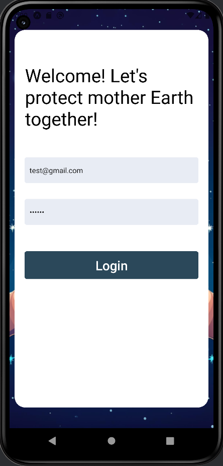

# Enviro

**Enviro** is a cross-platform mobile application built with Expo & React Native to help users identify if their trash is recyclable, locate the nearest recycling bin with directions, 
track carbon emissions saved by travelling without vehicles and visualize their environmental impact in a mini sanctuary whose health is depenedent on the user's actions.

---

## 🔍 Key Features

- **Secure Authentication**  
  • Sign up & log in with **Firebase Authentication** (email/password, Google)  
  • Secure logout and session management
   
  

- **Recylable Identifier**  
  • Snap a picture of trash on hand
  • Queries OpenAi Vision model if object is able to be recycled
   
  
  

- **Recycling bin locator**  
  • Accesses Google's geolocation services to identify current coordinates
  • Display nearest recyling bins based on current location 
  • Tapping on a recycling bin provides the shortest path with directions
   
  
  

- **Data Visualization**  
  • Interactive line & bar charts showing trend over time  
  • Displays the eco points the user gained either by recycling or travelling to places without vehicles 
  • Performs speed calculations via Google geolocation services to only track distance travelled on foot
   
  

- **Global Leaderboard**  
  • Real-time ranking of users by eco pointss  
  • Powered by **Firebase Firestore**
   
  

- **Sanctuary**  
  • Mini environment that reflects user's environmental actions through the app 
  • High amount of eco points results in thriving sanctuary while too low an amount will result in a polluted sanctuary
  • Virutal visualization to encourage users' to consider the impact of their actions
   
  
   

---

## 🛠️ Technology Stack

| Layer               | Tools & Libraries                                                    |
|---------------------|----------------------------------------------------------------------|
| **Framework**       | Expo SDK, React Native                                               |
| **UI & Navigation** | React Navigation                                                     |
| **State Management**| React Context API + Hooks                                            |
| **Backend & Auth**  | Firebase Authentication, Firestore (or Realtime Database)            |
| **Storage**         | AsyncStorage, Firebase Storage                                       |
| **Charts & Graphs** | Victory Native (or react-native-chart-kit)                           |
| **Maps & Location** | expo-location, react-native-maps, Google Maps REST API               |
| **Networking**      | Axios                                                                |

---

## Disclaimer
The google api key associated with this app has since been disabled. Geolocation features are no longer functional.
